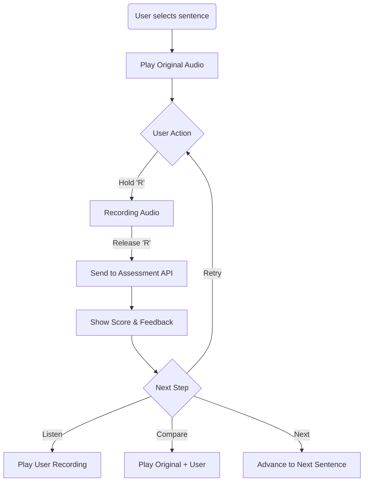

# Business Logic & Workflows

## 1. Shadowing Practice Loop

The core value proposition is the "Shadowing" cycle.



**Implementation Details:**

- **Audio Context**: Use Web Audio API for precise playback and recording.
- **Latency**: Assessment is async. UI must show a "processing" state but allow the user to listen to their raw recording immediately while waiting for the score.

## 1.1 Echo Mode (Transcript Region Loop)

Echo mode constrains playback to a selected transcript time window:

- **Window definition**: A contiguous transcript line range defines an echo window \([startTime, endTime]\) in seconds.
- **Seek clamping**: Any seek request is clamped into the window \([startTime, endTime)\) (with a small epsilon to avoid landing exactly at the end).
- **Playback looping**: During playback, if media time reaches the end of the window (accounting for timeupdate granularity), playback loops back to `startTime`.
- **Robustness**: The window is validated and normalized (finite numbers, ordered start/end, optional duration clamping) to tolerate imperfect timestamps and browser precision.

## 2. Local ASR (Offline Transcription)

To support free users and offline mode, we use **Transformers.js** to run OpenAI's Whisper model in the browser.

- **Model**: `quantized/whisper-tiny` or `whisper-small` (depending on device capability).
- **Web Worker**: ASR must run in a dedicated Web Worker to prevent UI freezing during inference.
- **Caching**: The model weights are cached in the browser cache storage after the first download.

**Flow:**

1. User imports video.
2. Check if subtitles exist. If yes, parse SRT.
3. If no, extract audio track.
4. Send audio chunk to ASR Worker.
5. Worker returns segments with timestamps.
6. Save segments to IndexedDB.

## 3. Vocabulary System (Contextual)

Words are not learned in isolation.

- **Saving a Word**: When a user clicks a word in subtitles:
  1. Capture the `word`.
  2. Capture the `sentence` (context).
  3. Capture the `timestamp`.
  4. Call AI Dictionary service for explanation *specific to this context*.
- **Review**: When reviewing, show the original sentence and play the specific audio clip where the word was encountered.

## 4. Data Access Pattern (Offline-First)

### Architecture

The app follows a strict layering pattern for data access:

```
UI Layer → React Query Hooks → Repository Layer → Dexie (IndexedDB)
```

### React Query Hooks (`src/hooks/queries/`)

All database operations go through React Query hooks:

- **Query Hooks**: Fetch data from IndexedDB with caching and automatic refetching
- **Mutation Hooks**: Save/update/delete data with automatic cache invalidation
- **Query Keys**: Centralized query key factories for cache management

**Example:**

```tsx
// UI component
import { useAudios, useSaveAudio } from '@/hooks/queries'

function MyComponent() {
  const { data: audios, isLoading } = useAudios({ translationKey: 'xyz' })
  const saveAudio = useSaveAudio()

  const handleSave = async () => {
    await saveAudio.mutateAsync({ ...audioInput })
    // Cache automatically invalidated, UI auto-updates
  }
}
```

### Repository Layer (`src/db/repositories/`)

Database operations are encapsulated in repository functions:

- **No direct Dexie access** from UI layer
- **Type-safe** operations with TypeScript
- **ID generation** handled internally

### Sync Strategy

- **Offline-First**: Reads are always from IndexedDB (local)
- **Write Pattern**: Mutations save to IndexedDB first, then trigger background sync
- **Conflict Resolution**: Last-write-wins for simple fields. For arrays (vocab), merge strategies are applied
- **Cache Management**: React Query handles cache invalidation automatically on mutations
