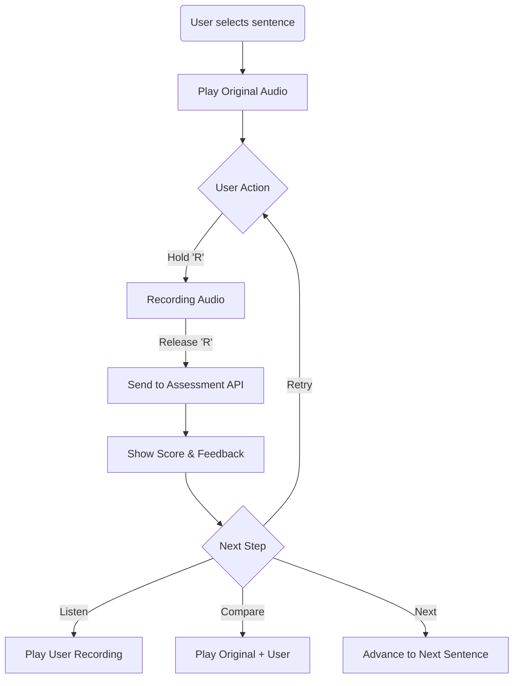

# Business Logic & Workflows

## 1. Shadowing Practice Loop

The core value proposition is the "Shadowing" cycle.

**Implementation Details:**
-   **Audio Context**: Use Web Audio API for precise playback and recording.
-   **Latency**: Assessment is async. UI must show a "processing" state but allow the user to listen to their raw recording immediately while waiting for the score.

## 2. Local ASR (Offline Transcription)

To support free users and offline mode, we use **Transformers.js** to run OpenAI's Whisper model in the browser.

-   **Model**: `quantized/whisper-tiny` or `whisper-small` (depending on device capability).
-   **Web Worker**: ASR must run in a dedicated Web Worker to prevent UI freezing during inference.
-   **Caching**: The model weights are cached in the browser cache storage after the first download.

**Flow:**
1.  User imports video.
2.  Check if subtitles exist. If yes, parse SRT.
3.  If no, extract audio track.
4.  Send audio chunk to ASR Worker.
5.  Worker returns segments with timestamps.
6.  Save segments to IndexedDB.

## 3. Vocabulary System (Contextual)

Words are not learned in isolation.

-   **Saving a Word**: When a user clicks a word in subtitles:
    1.  Capture the `word`.
    2.  Capture the `sentence` (context).
    3.  Capture the `timestamp`.
    4.  Call AI Dictionary service for explanation *specific to this context*.
-   **Review**: When reviewing, show the original sentence and play the specific audio clip where the word was encountered.

## 4. Sync Strategy (Offline-First)

-   **Dexie.js + TanStack Query**:
    -   Reads are always from Dexie (local).
    -   Writes go to Dexie first, then trigger a background sync mutation.
-   **Conflict Resolution**: Last-write-wins for simple fields. For arrays (vocab), merge strategies are applied.

